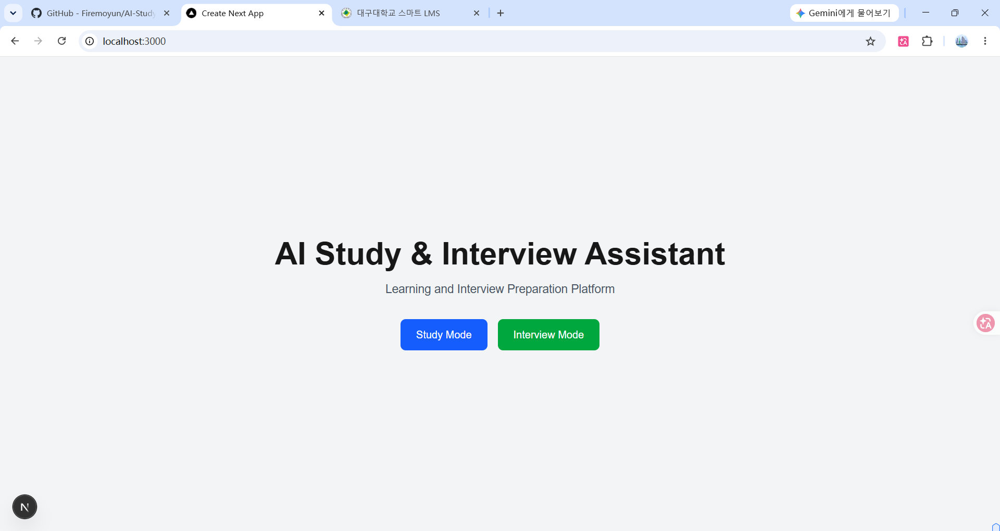
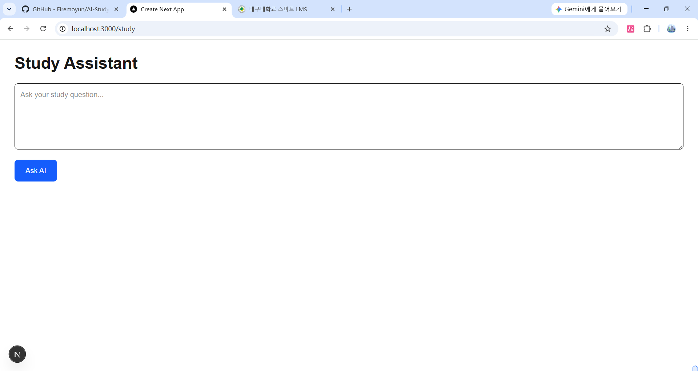
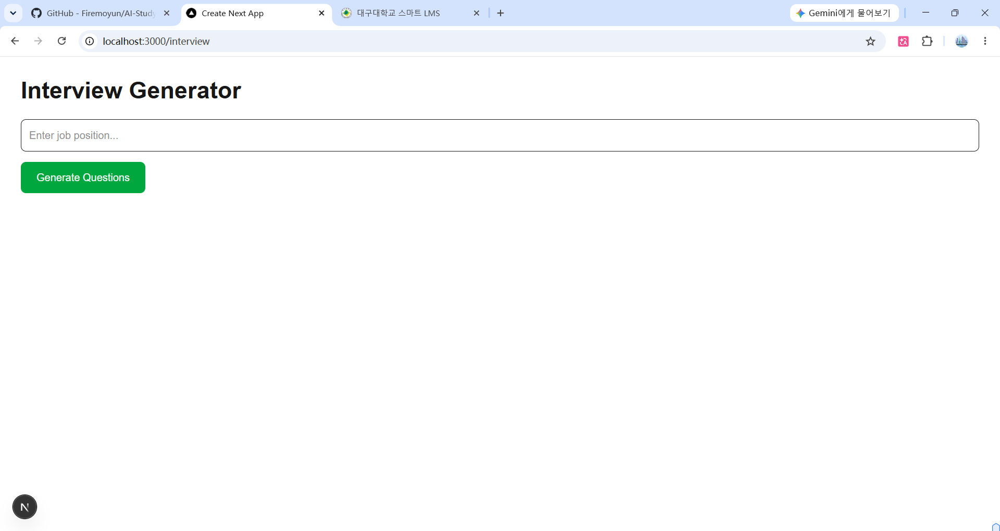

# AI Study & Interview Assistant

## Project Introduction

AI Study & Interview Assistant is a web application designed to help students study technical topics and prepare for job interviews.

This project was developed with the assistance of generative AI tools and built using Next.js.

## Main Features

### Study Assistant

* Enter study questions
* Provide learning support
* Help users review technical concepts

### Interview Generator

* Enter a job position
* Generate interview questions
* Practice interview preparation

## AI Tools Used
* Google Gemini API (primary AI model)
* ChatGPT (development assistance)

## Technology Stack

* Next.js
* React
* TypeScript
* Tailwind CSS
* Google Gemini API (AI Engine)
* Git & GitHub (Version Control)

## How to Run

```bash
npm install
npm run dev
```

Open:

http://localhost:3000

## Screenshots

### Home Page



### Study Assistant



### Interview Generator


## Author

려묵호
